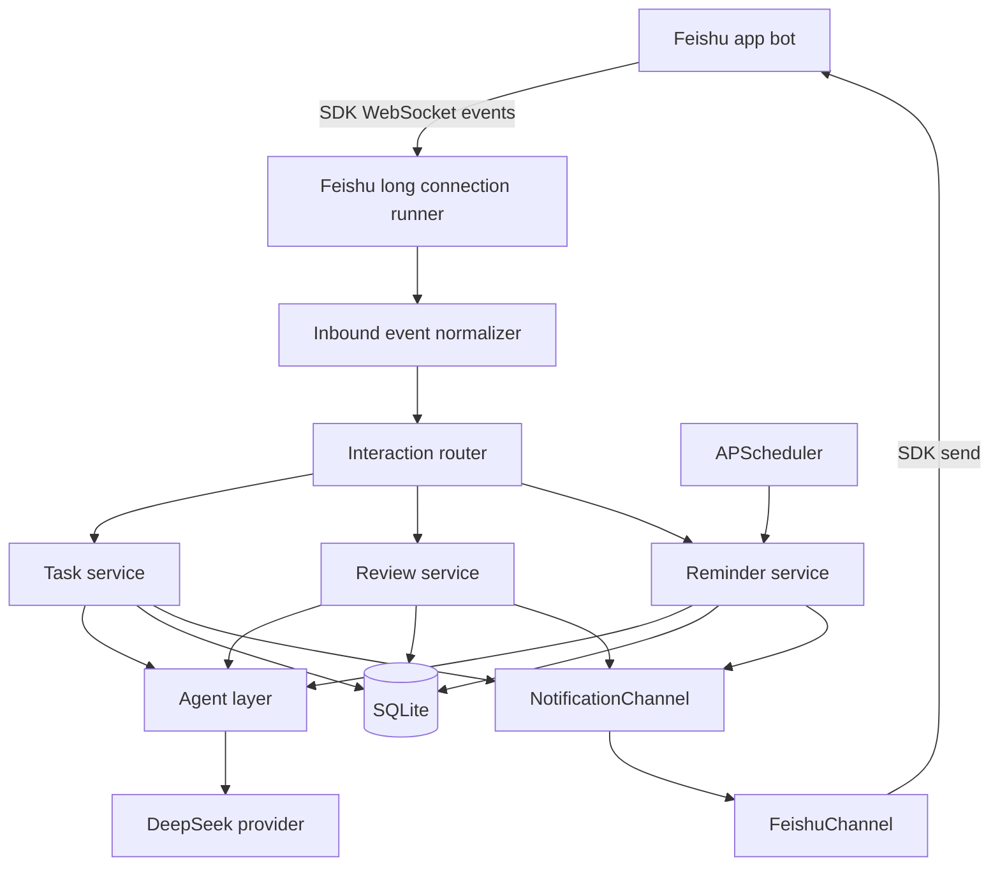

# feat: Build personal assistant agent MVP

## Summary

Build a Python/FastAPI personal assistant service that runs on a cloud server, receives Feishu private-chat events through the official SDK long connection, stores tasks/reminders/reviews in SQLite, and sends proactive reminders through a channel abstraction. The MVP uses DeepSeek through the OpenAI SDK-compatible Chat Completions API for lightweight natural-language understanding and message generation, while keeping the business logic independent of Feishu so later notification channels can be added.

---

## Problem Frame

The assistant is intended to help a single freelance user restore daily structure while working from home. The first version must handle reminders for work, rest, review, and sleep; understand task updates from chat; preserve review history; and avoid becoming a rigid alarm bot.

The upstream requirements document is `docs/brainstorms/personal-assistant-agent-requirements.md`.

---

## Requirements

**Assistant behavior**

- R1. The service must support Feishu private-chat interaction for adding, updating, confirming, postponing, cancelling, and reviewing tasks.
- R2. The assistant must generate proactive reminders for work, rest, evening review, sleep preparation, and sleep according to the default daily schedule.
- R3. Planned events must remind the user at a random time 10-30 minutes before the scheduled start.
- R4. A reminder awaiting confirmation must repeat every 10 minutes up to 3 total retry attempts, then stop and surface the missed response during evening review.
- R5. Rest periods must be quiet by default: 12:00-13:30 and 18:00-23:00 should not produce proactive work prompts unless the user explicitly scheduled one.
- R6. When no tasks exist, the assistant must ask the user whether they want to set 1-3 tasks instead of inventing work.
- R7. Evening review at 23:00 must update task state and save a structured review record.

**Data and identity**

- R8. The MVP must run as a single-user assistant while storing `user_id` on user-owned records.
- R9. Tasks, reminders, notification attempts, inbound interactions, and evening reviews must persist to SQLite.
- R10. Date and schedule calculations must use `Asia/Shanghai`; persisted instants must be stored in UTC.

**Integrations and extensibility**

- R11. Feishu inbound events must use the official Python SDK long connection by default, with encrypted webhook handling available only as a fallback mode.
- R12. Business logic must depend on a `NotificationChannel` abstraction, not direct Feishu message structures.
- R13. Interactive reminder buttons must map to channel-neutral actions such as `ack_reminder`, `snooze_reminder`, and `skip_today`.
- R14. All outbound messages must be rendered from a channel-neutral message model with plain-text fallback.
- R15. DeepSeek API calls must be isolated behind an `LLMProvider` abstraction.

**Operations and developer experience**

- R16. The app must run under Docker Compose with SQLite data mounted outside the container.
- R17. Configuration must use `.env` plus `.env.example`; secrets must not be committed.
- R18. Logs must be structured to stdout and redact secrets.
- R19. The project must include a uv-based development guide for local setup, dependency management, migrations, tests, and Docker usage.
- R20. Core service, scheduler, webhook, and persistence logic must have automated tests.

---

## Key Technical Decisions

- KTD1. Python + FastAPI service: FastAPI is sufficient for Feishu webhooks, health checks, and internal service composition without introducing a separate web framework or worker system.
- KTD2. SQLite + SQLAlchemy + Alembic: SQLite keeps deployment simple for one user, while SQLAlchemy and Alembic preserve a clean path to PostgreSQL if the assistant later becomes multi-user.
- KTD3. APScheduler inside the FastAPI process: The MVP has one user and a small reminder volume, so an embedded scheduler avoids Redis/Celery operational cost while still supporting dynamic rescheduling.
- KTD4. Channel abstraction before Feishu implementation: Feishu is the first delivery channel, not the product boundary. Business services should emit `OutboundMessage` and action IDs that the Feishu adapter renders through the SDK into text, rich text, or interactive cards.
- KTD5. Lightweight agent layer first: The MVP should not start with LangGraph, CrewAI, or a multi-agent framework. Use an `LLMProvider` plus typed intent/output models so a heavier framework can replace the agent layer later.
- KTD6. UTC persistence with Shanghai business time: Schedule generation, review dates, and user-facing text use `Asia/Shanghai`; database timestamps store UTC instants for predictable logs and deployment portability.
- KTD7. Structured stdout logs: Docker Compose naturally captures stdout. Add structured event logs before adding external monitoring.
- KTD8. Feishu SDK long connection: The MVP should use the official SDK WebSocket transport for inbound messages and card actions. Webhook encrypted callback handling remains as a fallback for deployments that prefer HTTP callbacks.

---

## High-Level Technical Design



The central rule is that `TaskService`, `ReminderService`, and `ReviewService` never construct Feishu payloads. They produce channel-neutral messages and consume channel-neutral actions. Feishu-specific encryption, event shapes, card payloads, and access-token handling stay inside the Feishu adapter layer.

---

## Output Structure

```text
app/
  main.py
  api/
    routes/
  agent/
  channels/
  config/
  db/
  models/
  schemas/
  scheduler/
  services/
  utils/
alembic/
docs/
  development.md
tests/
  agent/
  channels/
  services/
  scheduler/
  api/
```

The exact file split can adjust during implementation, but the boundaries should remain: API adapters, channel adapters, services, scheduler, agent, and storage stay separate.

---

## Data Model

Initial tables should cover the first version without over-modeling:

- `users`: single configured user, Feishu identity fields, timezone, style preference placeholder.
- `tasks`: title, description, importance, type, status, planned date/time, estimated duration, actual completion time, source, notes, `user_id`.
- `reminders`: planned event/task reference, scheduled start time, randomized reminder time, status, confirmation state, retry count, next retry time, quiet-period override flag, `user_id`.
- `notification_attempts`: reminder/review reference, channel, provider message ID, status, sent time, error summary.
- `reviews`: review date, completed summary, unfinished summary, tomorrow plan, mood/state note, missed reminder notes, raw user response, structured LLM output, `user_id`.
- `inbound_messages`: channel, channel message ID, sender identity, normalized text/action, received time, dedupe key, processing status.

Use enums in application code for task status, task type, importance, reminder status, channel action, and inbound interaction type. Store enum values as stable lowercase strings.

---

## Implementation Units

### U1. Project Scaffold And Developer Tooling

**Goal:** Create the Python service skeleton, uv project metadata, Docker Compose deployment shape, and developer documentation.

**Requirements:** R16, R17, R19.

**Dependencies:** None.

**Files:**

- `pyproject.toml`
- `uv.lock`
- `.env.example`
- `.gitignore`
- `Dockerfile`
- `docker-compose.yml`
- `app/main.py`
- `app/config/settings.py`
- `docs/development.md`
- `tests/test_health.py`

**Approach:** Configure uv-managed dependencies for FastAPI, Uvicorn, SQLAlchemy, Alembic, APScheduler, OpenAI SDK, HTTP client, Pydantic settings, pytest, and logging helpers. The OpenAI SDK is used as the DeepSeek-compatible client. Add a `/healthz` route that does not touch external services. Docker Compose should mount a host data directory for SQLite and load env vars through `env_file`.

**Patterns to follow:** No existing application patterns are present in the repo. Use conventional FastAPI app factory and Pydantic settings patterns.

**Test scenarios:**

- Health route returns success without requiring Feishu, DeepSeek, or SQLite migrations.
- Settings load required values from environment and reject missing required secrets in non-test mode.
- Test mode can run with in-memory or temporary SQLite configuration.

**Verification:** A developer can follow `docs/development.md` to install uv, sync dependencies, run tests, run migrations, and start the service locally or with Docker Compose.

### U2. Database Models And Migrations

**Goal:** Add SQLAlchemy models, Alembic migrations, and repository helpers for users, tasks, reminders, notification attempts, inbound messages, and reviews.

**Requirements:** R8, R9, R10.

**Dependencies:** U1.

**Files:**

- `alembic.ini`
- `alembic/env.py`
- `alembic/versions/0001_initial_schema.py`
- `app/db/base.py`
- `app/db/session.py`
- `app/models/user.py`
- `app/models/task.py`
- `app/models/reminder.py`
- `app/models/notification_attempt.py`
- `app/models/inbound_message.py`
- `app/models/review.py`
- `app/models/enums.py`
- `tests/db/test_migrations.py`
- `tests/services/test_repositories.py`

**Approach:** Keep database tables explicit and boring. Add uniqueness or dedupe constraints for inbound channel message IDs. Store UTC timestamps as timezone-aware datetimes. Use repository functions only where they reduce duplicated query logic; avoid hiding simple SQLAlchemy usage behind a large generic repository framework.

**Patterns to follow:** SQLAlchemy 2.x typed declarative models and Alembic migration conventions.

**Test scenarios:**

- Alembic upgrade creates all expected tables in a temporary SQLite database.
- Creating a task persists `user_id`, planned date/time, importance, type, and status.
- Duplicate inbound Feishu message IDs are rejected or ignored through a deterministic dedupe path.
- UTC timestamp fields round-trip as timezone-aware values.
- Review records persist raw response and structured summary fields.

**Verification:** The schema can be created from a clean SQLite file and supports the data needed by reminder, task, and review services.

### U3. Channel-Neutral Message And Action Model

**Goal:** Define the internal notification contract used by services before implementing Feishu-specific rendering.

**Requirements:** R12, R13, R14.

**Dependencies:** U1.

**Files:**

- `app/channels/base.py`
- `app/channels/messages.py`
- `app/channels/actions.py`
- `app/services/message_renderer.py`
- `tests/channels/test_message_model.py`
- `tests/services/test_message_renderer.py`

**Approach:** Create models such as `OutboundMessage`, `MessageSection`, `MessageField`, and `MessageAction`. Actions carry stable internal IDs and typed payloads, not Feishu card values. The renderer should provide fixed structures for task list, reminder, review prompt, acknowledgement, quiet-time notice, and error messages. LLM-generated text can fill body copy, but title, fields, and actions remain deterministic.

**Patterns to follow:** Pydantic models or dataclasses for typed contracts; keep channel adapters as implementations of a small `NotificationChannel` protocol.

**Test scenarios:**

- Reminder renderer returns title, planned time, importance, body, plain-text fallback, and the expected actions.
- Task-list renderer preserves ordering and shows importance, type, status, and planned time.
- Every message has a plain-text fallback.
- Button actions use internal action IDs and do not contain Feishu-specific payload keys.

**Verification:** Service tests can assert outbound message semantics without importing Feishu code.

### U4. Feishu SDK Channel And Long Connection Adapter

**Goal:** Implement Feishu SDK long connection event handling, event normalization, message sending, and interactive card rendering through the channel abstraction.

**Requirements:** R1, R11, R12, R13, R14, R18.

**Dependencies:** U1, U3.

**Files:**

- `app/api/routes/feishu.py`
- `app/channels/feishu/client.py`
- `app/channels/feishu/crypto.py`
- `app/channels/feishu/events.py`
- `app/channels/feishu/long_connection.py`
- `app/channels/feishu/render.py`
- `app/channels/feishu/channel.py`
- `tests/channels/test_feishu_channel.py`
- `tests/channels/test_feishu_crypto.py`
- `tests/channels/test_feishu_long_connection.py`
- `tests/channels/test_feishu_render.py`

**Approach:** Use the official Feishu Python SDK `FeishuChannel` with WebSocket transport as the default inbound path. Normalize SDK `message` and `cardAction` events into the app's `InboundInteraction` model, then dispatch them through `InteractionRouter`. Use the SDK channel for outbound sending so token management and API calls stay inside the SDK. Keep encrypted webhook handling available as a fallback path.

**Patterns to follow:** Feishu official Python SDK `lark-oapi`; SDK `FeishuChannel.on("message")`, `FeishuChannel.on("cardAction")`, `FeishuChannel.start_background()`, and `FeishuChannel.send(...)`.

**Test scenarios:**

- SDK message event dispatches a normalized inbound message.
- SDK card action event dispatches a normalized internal action.
- Long connection starts and stops through application lifespan.
- Webhook fallback still rejects invalid verification tokens when enabled.
- Duplicate message event does not process twice.
- Channel-neutral reminder actions render as Feishu card buttons with recoverable internal action payloads.
- Message send failures create a failed notification attempt without leaking secrets to logs.

**Verification:** SDK event fixtures can be processed into normalized interactions, and outbound messages render without business services depending on SDK payload shape.

### U5. Task Service And Intent Handling

**Goal:** Implement task creation, updates, status transitions, and natural-language intent routing for user messages.

**Requirements:** R1, R6, R8, R9, R15.

**Dependencies:** U2, U3.

**Files:**

- `app/agent/provider.py`
- `app/agent/deepseek_provider.py`
- `app/agent/intents.py`
- `app/services/task_service.py`
- `app/services/interaction_router.py`
- `app/schemas/tasks.py`
- `tests/agent/test_intent_models.py`
- `tests/services/test_task_service.py`
- `tests/services/test_interaction_router.py`

**Approach:** Use DeepSeek through `LLMProvider` for structured outputs such as `create_task`, `update_task`, `complete_task`, `postpone_task`, `cancel_task`, `acknowledge`, `small_talk`, and `unknown`. Button actions can remain deterministic because they already carry explicit action IDs. Natural-language messages should not use local parsing fallbacks; if the LLM is unavailable, return the unified assistant-offline message.

**Patterns to follow:** Provider abstraction with typed request/response objects. Avoid storing raw chain-of-thought or hidden model reasoning.

**Test scenarios:**

- Button acknowledgement bypasses LLM and confirms the related reminder.
- Natural-language task creation with title, importance, planned date, planned time, and duration creates a task.
- “做完了” updates the most relevant active task when unambiguous.
- Ambiguous completion asks a follow-up instead of updating the wrong task.
- “今天不做了” cancels or skips the relevant task according to action context.
- No-task morning interaction prompts for 1-3 tasks instead of fabricating tasks.
- LLM provider failure returns the unified assistant-offline message and logs the error.

**Verification:** Core task operations work with deterministic action inputs and with mocked structured LLM outputs.

### U6. Reminder Scheduling And Quiet-Time Rules

**Goal:** Implement schedule generation, randomized pre-reminders, confirmation retry behavior, snoozing, and quiet-period enforcement.

**Requirements:** R2, R3, R4, R5, R10.

**Dependencies:** U2, U3, U5.

**Files:**

- `app/scheduler/app_scheduler.py`
- `app/services/reminder_service.py`
- `app/services/daily_schedule_service.py`
- `app/utils/timezone.py`
- `tests/scheduler/test_app_scheduler.py`
- `tests/services/test_reminder_service.py`
- `tests/services/test_daily_schedule_service.py`
- `tests/utils/test_timezone.py`

**Approach:** Generate default daily reminder records for 09:00 work, 12:00 lunch/rest, 13:30 afternoon work, 18:00 end work, 23:00 review, 23:30 sleep preparation, and 24:00 sleep. For each proactive event, calculate a reminder time 10-30 minutes before start unless the event type should fire exactly by product choice. Store scheduled jobs in the database and load active jobs into APScheduler on startup. Use idempotent job handlers so process restarts do not double-send messages.

**Patterns to follow:** APScheduler with explicit timezone and persistent state in the application database rather than relying only on in-memory jobs.

**Test scenarios:**

- Generated work reminder time falls between 10 and 30 minutes before planned start.
- Shanghai date boundaries handle 24:00 sleep as the next day’s 00:00 instant while keeping the user-facing label.
- Reminder confirmation cancels further retries.
- No response schedules retries every 10 minutes and stops after 3 attempts.
- Snooze action updates next reminder time and retry state.
- Quiet period blocks proactive work prompts but allows explicitly scheduled reminders.
- Scheduler startup reloads pending reminders without duplicating already-sent attempts.

**Verification:** Time-dependent behavior is covered with frozen-time tests and does not depend on the host machine timezone.

### U7. Evening Review Service

**Goal:** Implement the 23:00 review prompt, parse review responses, update tasks, save structured review history, and carry forward tomorrow’s tasks.

**Requirements:** R7, R8, R9, R15.

**Dependencies:** U2, U3, U5, U6.

**Files:**

- `app/services/review_service.py`
- `app/agent/review_parser.py`
- `app/schemas/reviews.py`
- `tests/services/test_review_service.py`
- `tests/agent/test_review_parser.py`

**Approach:** Review starts as a structured prompt with three questions: completed work, unfinished work, and tomorrow’s plan. The parser returns completed task references, postponed tasks, cancelled tasks, new tomorrow tasks, freeform state notes, and missed-reminder explanations. Persist both raw user text and normalized fields. Apply task updates in a transaction so review and task changes stay consistent.

**Patterns to follow:** Same `LLMProvider` abstraction and typed structured-output models as task intent handling.

**Test scenarios:**

- Review prompt includes today’s task list and missed reminder notes when present.
- Review response marking a task complete updates that task and stores the review.
- Review response postponing unfinished work marks tasks as postponed and creates/reschedules tomorrow work where appropriate.
- New tomorrow tasks from review are created with source `review`.
- Parser ambiguity creates a follow-up message rather than applying destructive changes.
- Transaction rollback leaves tasks unchanged if review persistence fails.

**Verification:** Evening review can be exercised with mocked parser output and produces both task updates and a durable review record.

### U8. DeepSeek Provider And Assistant Voice

**Goal:** Add DeepSeek-backed generation for structured task/review parsing and context-aware message copy while preserving deterministic service behavior.

**Requirements:** R14, R15.

**Dependencies:** U3, U5, U7.

**Files:**

- `app/agent/prompts.py`
- `app/agent/deepseek_provider.py`
- `app/agent/message_copy.py`
- `tests/agent/test_deepseek_provider.py`
- `tests/agent/test_message_copy.py`

**Approach:** Separate parser prompts from message-copy prompts. Parser calls must use DeepSeek Chat Completions JSON Output (`response_format={"type":"json_object"}`) and validate the result with Pydantic models. Copy-generation calls receive bounded context: current task, time of day, reminder type, missed response state, and style preference. If DeepSeek is unavailable for user messages, return the unified assistant-offline message instead of local natural-language fallback parsing.

**Patterns to follow:** Low-temperature structured parsing; never let generated prose decide task state without typed validation.

**Test scenarios:**

- Structured parsing rejects missing required fields and returns a recoverable error.
- Reminder copy includes the relevant task context but cannot change task status.
- Rest reminder copy does not ask for work progress.
- Sleep reminder copy uses lower-stimulation phrasing.
- DeepSeek timeout returns the unified assistant-offline message for user messages.

**Verification:** Agent behavior remains testable with mocked provider responses and service logic does not depend on live DeepSeek calls.

### U9. Operations, Logging, And Authorization Boundaries

**Goal:** Add single-user authorization, structured logging, secret redaction, Docker runtime defaults, and operational sanity checks.

**Requirements:** R8, R16, R17, R18.

**Dependencies:** U1, U2, U4.

**Files:**

- `app/config/logging.py`
- `app/services/authz_service.py`
- `app/utils/redaction.py`
- `docker-compose.yml`
- `.env.example`
- `tests/services/test_authz_service.py`
- `tests/utils/test_redaction.py`

**Approach:** Configure allowed Feishu user/chat IDs through environment variables. Reject unauthorized inbound interactions before they reach task services. Emit structured logs for webhook receipt, validation result, interaction routing, task mutation, reminder send, retry scheduling, LLM call outcome, and review persistence. Redact secrets and provider tokens from logs.

**Patterns to follow:** stdout logging for Docker; avoid file-based logs in the container.

**Test scenarios:**

- Authorized Feishu sender is accepted.
- Unauthorized sender is ignored or receives a minimal non-sensitive response, according to final implementation choice.
- Secret-like values are redacted from structured log fields.
- Critical events include stable event names and correlation IDs.
- Docker Compose keeps SQLite data under a mounted data path.

**Verification:** `docker compose logs` gives enough signal to diagnose missed reminders, webhook failures, LLM failures, and database errors.

### U10. End-To-End MVP Flow Tests

**Goal:** Add focused integration tests that prove the main assistant loops work across services without requiring live Feishu or DeepSeek.

**Requirements:** R1-R20.

**Dependencies:** U2, U3, U4, U5, U6, U7, U8, U9.

**Files:**

- `tests/integration/test_daily_reminder_flow.py`
- `tests/integration/test_feishu_message_to_task_flow.py`
- `tests/integration/test_review_flow.py`
- `tests/fixtures/feishu_events.py`

**Approach:** Use fake Feishu and fake LLM providers. Exercise the main flows with temporary SQLite databases and frozen time. Keep tests deterministic by injecting random reminder offsets where needed.

**Patterns to follow:** Integration tests should verify component wiring and state transitions, not duplicate every unit-level edge case.

**Test scenarios:**

- User sends a natural-language task; service stores it and replies with a task-list confirmation.
- Scheduler sends a work reminder, user clicks “知道了”, and no retries are scheduled.
- Scheduler sends a work reminder, user does not respond, retries stop after 3 attempts, and review includes the missed reminder.
- User clicks “推迟 10 分钟”; next reminder is rescheduled and persisted.
- 23:00 review saves a review record, completes one task, postpones one task, and creates tomorrow’s task.

**Verification:** The MVP’s core behavior is proven without external network calls.

---

## Acceptance Examples

- AE1. Given a task planned for 09:00, when daily reminders are generated, then the first reminder is scheduled between 08:30 and 08:50 Shanghai time.
- AE2. Given a reminder has been sent and the user clicks “知道了”, when the retry scheduler runs, then no further reminders are sent for that reminder.
- AE3. Given a reminder receives no response, when three retry attempts have elapsed, then it stops retrying and is referenced during the 23:00 review.
- AE4. Given the time is 12:30 and no explicit reminder was scheduled, when the scheduler scans due work prompts, then no proactive work prompt is sent.
- AE5. Given the user writes “明天上午做客户报价，比较重要，9 点开始”, when the message is processed, then a high-importance work task is created for tomorrow at 09:00.
- AE6. Given the user completes the evening review, when tasks are updated, then the review record and task changes are committed together.

---

## Scope Boundaries

**In scope for MVP**

- One configured user.
- Feishu private-chat interaction.
- SQLite persistence.
- DeepSeek-backed parsing and copy, with no local natural-language fallback parsing for user messages.
- Fixed default daily schedule.
- Button actions plus natural-language replies.

**Deferred for later**

- Multi-user onboarding.
- Group-chat-first workflows.
- Web or mobile UI.
- Weekend-specific schedules.
- Advanced “bad day” or all-day quiet modes.
- Detailed analytics, reports, or productivity scoring.
- Additional channels such as Telegram, WeChat, Slack, email, SMS, or push notifications.

**Outside this product version**

- Verifying whether the user is truly working.
- Replacing the user’s own judgment about what work matters.
- Building a full project management suite.

---

## Risks And Dependencies

- Feishu encrypted callback details are external and version-sensitive. Use official docs and fixture-based tests around the crypto boundary.
- APScheduler jobs are in-process. If the container is stopped, reminders will not fire until it starts again; startup must reconcile overdue/pending reminders.
- SQLite is sufficient for a single user but needs backup discipline. Docker data mounts should be documented.
- DeepSeek calls can fail or be slow. User-message flows should return the unified assistant-offline message; reminder copy can use deterministic templates.
- Over-logging user messages could expose private data. Logs should default to event summaries, IDs, and redacted fields.
- LLM parsing may infer the wrong task from vague input. Ambiguous destructive updates should ask a follow-up.

---

## Documentation And Operational Notes

- `docs/development.md` should teach uv basics for this project: install uv, run `uv sync`, add dependencies, run tests, run Alembic migrations, start FastAPI locally, and run Docker Compose.
- `.env.example` should list required configuration names without real values: DeepSeek key/model settings, Feishu app credentials, Feishu encrypt key/token, allowed Feishu user/chat, database URL/path, timezone, and logging level.
- Add a short Feishu setup checklist covering app bot enablement, event subscription URL, encrypted callback settings, required permissions, and private-chat testing.
- Document how to inspect logs with Docker Compose and where SQLite data lives on the server.

---

## Sources And Research

- Origin requirements: `docs/brainstorms/personal-assistant-agent-requirements.md`.
- Feishu event subscription encrypted callback docs: `https://open.feishu.cn/document/event-subscription-guide/event-subscriptions/event-subscription-configure-/choose-a-subscription-mode/send-notifications-to-developers-server?lang=zh-CN`.
- Feishu receive message event docs: `https://open.feishu.cn/document/server-docs/im-v1/message/events/receive?lang=zh-CN`.
- Feishu send message API docs: `https://open.feishu.cn/document/server-docs/im-v1/message/create?lang=zh-CN`.
